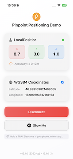

# Pinpoint Positioning Demo App

A simple SwiftUI demo app showing how to connect to a **TRACElet** device and display its **local** and **global (WGS84)** position data in real time.

## Overview

The **PinpointSampleApp** demonstrates:
- Connecting to a **TRACElet** (Bluetooth device)
- Receiving **local XYZ coordinates**
- Displaying **world coordinates (latitude & longitude)**
- Managing a reference point for world alignment
- Showing connection state and accuracy

## How to use

### 1. Launch the App
When the app starts, you’ll see two main sections:
- **Local Position (X, Y, Z, Accuracy)**
- **WGS84 Coordinates (Latitude, Longitude)**

Each value updates when your TRACElet is connected and streaming data.

### 2. Connect to a TRACElet
Tap **Connect**.

> 💡 Hold your TRACElet close to the phone while connecting.

- The status light turns **green** when connected.
- The app will start showing **live position updates**.

If you want to disconnect, just tap **Disconnect**.

### 3. View Your Position
Once connected:
- **LocalPosition** shows the TRACElet’s coordinates in the local coordinate system.
- **WGS84 Coordinates** show your geographic position (latitude and longitude).

### 4. Adjust Reference Coordinates
Tap the ⚙️ **gear icon** in the *WGS84 Coordinates* card to set a **reference latitude, longitude, and azimuth**.  
This defines how the local coordinate system aligns with the real world.

### 5. “Show Me” 
If connected, tap **Show Me** to trigger the TRACElet’s “show me” action - a visual feedback feature provided by the device.

## Buttons Summary

| Button | Action |
|--------|---------|
| **Connect / Disconnect** | Connects or disconnects from the TRACElet |
| **Show Me** | Requests the TRACElet to indicate itself (lighting up an LED) |
| **Gear (⚙️)** | Set reference coordinates for WGS84 conversion |

## Developer Notes
This app is a **demo** for:
- Testing the connection with a TRACElet
- Exploring how to handle positioning data from Pinpoint hardware
- Experimenting with coordinate transformations

## UI Preview

