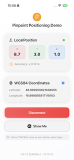

# Pinpoint Positioning Demo App

A simple SwiftUI demo app showing how to connect to a use the **Pinpoint iOS SDK** to 
get precise indoor positions.

## Overview

The **PinpointSampleApp** demonstrates:
- Start a Position Stream (native UWB or TRACElet)
- Receiving **local coordinates**
- Displaying **world coordinates (latitude & longitude)**
- Showing connection state and accuracy

## How to use

### 1. Launch the App
When the app starts, you’ll see two main sections:
- **Local Position (X, Y, Z, Accuracy)**
- **WGS84 Coordinates (Latitude, Longitude)**

Each value updates when your TRACElet is connected and streaming data.

### 2. Start Position Stream
Tap **Start Positioning**.

>  The app will try to use native UWB, if supported by the device. Else it will use a BLE TRACElet connection. You can force using BLE by setting the toggle.

You should see updating local positions as well as WGS84 coordinates

**Start Positioning** will also start a LiveActivity. You can put the app in the background and lock the screen now. The positioning will continue

**Stop Positioning** will stop the internal UWB chip or disconnect from TRACElet. This will also stop the LiveActivity.

### 3. View Your Position
Once connected:
- **LocalPosition** shows the TRACElet’s coordinates in the local coordinate system.
- **WGS84 Coordinates** show your geographic position (latitude and longitude).

### 4. “Show Me” 
If connected, tap **Show Me** to trigger the TRACElet’s “show me” action - a visual feedback feature provided by the device. (Only applicable if using a BLE TRACElet)

## Buttons Summary

| Button | Action |
|--------|---------|
| **Start Positioning / Stop Positioning** | Starts the Position Stream |
| **Show Me** | Requests the TRACElet to indicate itself (lighting up an LED) |

## Developer Notes
This app is a **demo** for:
- Development with native UWB support (NIDLTDOA)
- Testing the connection with a TRACElet 
- Exploring how to handle positioning data from Pinpoint hardware
- Implementing LiveActivities for UWB background support

## UI Preview

