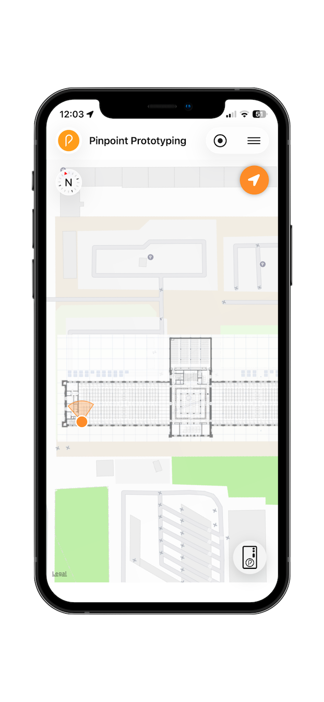

# Pinpoint iOS SDK

## Introduction
The Pinpoint iOS SDK is a Swift package for [FiRa](https://www.firaconsortium.org) compliant Ultra-Wideband (UWB) positioning with [Pinpoint's](https://pinpoint.de) technology.


## Example Apps

The Pinpoint iOS can be used to integrate our indoor positioning system into your own solutions.

<div align="center">

## Screenshots

| Routing Solution | Integration with Apple Maps |
|:---:|:---:|
|  |  |
| *Example application showing routing solution* | *Example application with Apple Maps integration* |

</div>


## Features 


* Indoor Positioning for GNSS/GPS denied areas
* Accuracy of up to 30 cm
* Simple Integration

---


## Prerequisites

Before integrating the Pinpoint iOS SDK, please ensure you have access to the necessary Pinpoint hardware components.

The SDK requires compatible **Pinpoint Hardware** for accurate indoor positioning. Depending on your use case, you can use one of the following hardware options:

- **[Prototyping Kit](https://pinpoint.de/en/products/hardware/prototyping-kit):**  
  Ideal for developers and researchers who want to quickly evaluate and experiment with Pinpoint’s indoor positioning capabilities.  
  The kit includes all essential components required to set up a small-scale test environment.

- **[SATlets](https://pinpoint.de/en/products/hardware/satlet):**  
  Compact satellite modules designed for scalable and permanent installations.  
  SATlets are suitable for production environments or larger deployments requiring reliable and precise indoor localization.

To ensure optimal performance, confirm that your hardware is correctly installed and configured before running the SDK.


## Installation

To integrate the `Pinpoint iOS SDK` add the repo as a swift package dependency to you project using the Swift Package Manager. [Apple Docs - Adding package dependencies to your app](https://developer.apple.com/documentation/xcode/adding-package-dependencies-to-your-app)

### Versioning
This package highly depends in the Pinpoint Hardware you are using.

Make sure to use the corresponding tag (e.g. 12.1.0) when adding this package to your project,


## Usage

To use the `Pinpoint iOS SDK`  in your iOS project, follow the steps below..

The provided demo app is this repo can be used as an implementation example for the SDK.

The usage examples below can be found in `PositionProvider.swift` inside the demo app.


### Importing the Module

First, import the module at the top of your Swift file:

```swift
import PinpointSDK
```

The `PinpointApi` class provides various functions to interact with nearby tracelets using Bluetooth. 

Below are the main functions available for public use:

### Singleton Instance

Access the singleton instance of the `API` class:

```swift
let api = PinpointApi.shared
```

### Set up callbacks for state changes and position changes

```
    init() {
        setUpStateListener()
        setUpPositionListener()
    }
    
    
    func setUpPositionListener() {
        api.onPositionUpdate = { position in
            self.handleNewPosition(position)
        }
    }
    
    
    func setUpStateListener() {
        api.onStateChange = { state in
            self.connectionState = state
        }
    }
    
    // Handle position changes
    // Returns a `LocalPosition` object
    private func handleNewPosition(_ position: LocalPosition?) {
        localPosition = position
        generateWorldPosition()
    }
    
```

#### Listen to @Published position stream (Alternative)

Altenatively, you can listen to changes within the published variable `api.localPosition`  directly, when using SwiftUI

```swift

.onAppear {
    // Set initial position
    xPos = api.localPosition.xCoord
    yPos = api.localPosition.yCoord
}
.onChange(of: api.localPosition) { newPosition in
    // Update position when localPosition changes
    xPos = newPosition.xCoord
    yPos = newPosition.yCoord
}

```

### Connecting to a TRACElet / starting position export

The process to receive local positions from the TRACElet requires three steps:

* Scan for Pinpoint Bluetooth TRACElets
* Connect to the TRACElet
* Send the `startPositioning` command

For convience, you can perform all three steps within one function:


```swift
    func connectTraceletAndStart() async throws -> Bool {
        guard isBleReady() else { return false}
        
        let devices = try await withCheckedThrowingContinuation { continuation in
            var hasResumed = false
            api.scan(timeout: 3.0) { devices in
                guard !hasResumed else { return }
                hasResumed = true
                continuation.resume(returning: devices)
            }
        }
        // The `scan()` function returns a sorted list by RSSI of Pinpoint TRACElets
        // Usually it is fine to connect to the first one in the list (the only one / closest one)
        guard let tracelet = devices.first else { return false }
        // Store connected Tracelet
        connectedTracelet = tracelet.peripheral
        
        let success = try await connectToTraceletAndStartPositioning(tracelet)
        return success
    }

    
    // Convienience function to connect to the TRACElet and start the position stream
   private func connectToTraceletAndStartPositioning(_ tracelet: DiscoveredTracelet) async throws -> Bool {
        let success = try await api.connectAndStartPositioning(device: tracelet.peripheral)
        return success
    }
    
    // Getter function to the check current BLE state
    func isBleReady() -> Bool {
        return api.bleState == .BT_OK
    }
    
```


*Hint:* The function `connectAndStartPositioning(device: tracelet)` will set up the tracelet with settings, broadcasted by the SATlets.
This will only work, if you are in a location with a set up Pinpoint UWB network!


### Stop the scanning process manually

```swift
api.stopScan()
```

### Disconnect TRACElet

```swift
    func disconnect() {
        Task {
            await api.disconnect()
        }
    }
```


### Converting local positions to WGS84 coordinates

```swift
    func generateWorldPosition() {
        if let localPos = self.localPosition,
           let lat = REF_LAT,
           let lon = REF_LON,
           let azi = REF_AZI {
            
            let uwbPosition = CGPoint(x: localPos.x, y: localPos.y)
            self.worldPosition = WGS84Position(refLatitude: lat, refLongitude: lon, refAzimuth: azi)
                .getWGS84Position(uwbPosition: uwbPosition)
        }
    }
```

This will return you a WGS84 coordinate as `CLLocationCoordinate2D`.


---

### More Tracelet Commands

Send a "ShowMe" command to a connected tracelet:

```swift
    func showMe() async -> Bool {
        if let tracelet = connectedTracelet {
            let success = await api.showMe(tracelet: tracelet)
            return success
        } else {
            return false
        }
    }
```

Stop UWB-positioning on a connected TRACElet:

```swift
let success = api.stopPositioning()
```

Set the positioning interval:

```swift
let success = await api.setMotionCheckInterval(interval: 1) // Interval in n x 250ms, Default: 1 (update every 1 x 250ms)
```

### Retrieving Tracelet Information

Request the status of a connected TRACElet:

```swift
if let status = await api.getStatus() {
    print("Tracelet status: \(status)")
}
```

Request the firmware version of a connected TRACElet:

```swift
if let version = await api.getVersion() {
    print("Tracelet firmware version: \(version)")
}
```


### License 

This package is licensed under a proprietary license. Please refer to the LICENSE file for more details.
