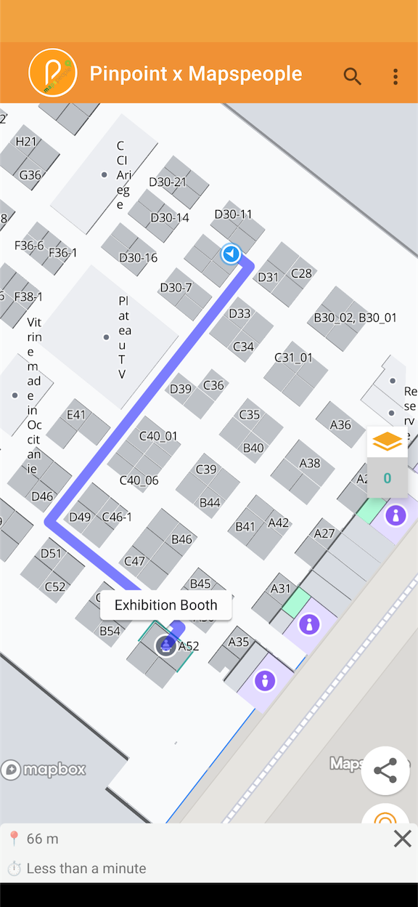
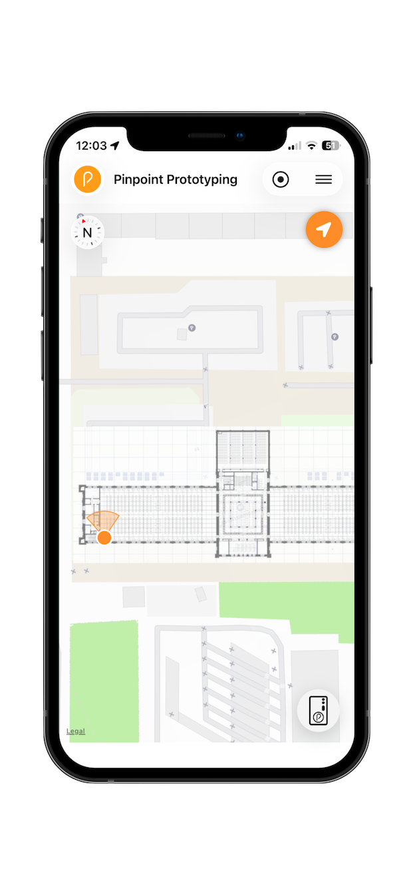
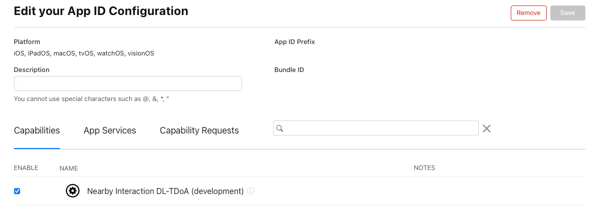

# Pinpoint iOS SDK

## Introduction

The Pinpoint iOS SDK is a Swift package for [FiRa](https://www.firaconsortium.org) compliant Ultra-Wideband (UWB) positioning with [Pinpoint's](https://pinpoint.de) technology.


## Use Cases

The Pinpoint iOS can be used to integrate our indoor positioning system into your own solutions.

<div align="center">


## Use Case examples

|                       Routing Solution                       |                 Integration with MapBox                  |
| :----------------------------------------------------------: | :----------------------------------------------------------: |
|  |  |
|                  Navigation with MapsPeople                  |                   Positioning with MapBox                    |

</div>


## Features 


* Indoor Positioning for GNSS/GPS denied areas
* Accuracy of up to 30 cm
* Simple Integration

---


## Prerequisites

Before integrating the Pinpoint iOS SDK, please ensure you have access to the necessary Pinpoint hardware components.

The SDK requires compatible **Pinpoint Hardware** for accurate indoor positioning. Depending on your use case, you can use one of the following hardware options:

- **[Prototyping Kit](https://pinpoint.de/en/products/hardware/prototyping-kit):**  
  Ideal for developers and researchers who want to quickly evaluate and experiment with Pinpoint’s indoor positioning capabilities.  
  The kit includes all essential components required to set up a small-scale test environment.

- **[SATlets](https://pinpoint.de/en/products/hardware/satlet):**  
  Compact satellite modules designed for scalable and permanent installations.  
  SATlets are suitable for production environments or larger deployments requiring reliable and precise indoor localization.

To ensure optimal performance, confirm that your hardware is correctly installed and configured before running the SDK.


## Installation

To integrate the `Pinpoint iOS SDK` add the repo as a swift package dependency to you project using the Swift Package Manager. [Apple Docs - Adding package dependencies to your app](https://developer.apple.com/documentation/xcode/adding-package-dependencies-to-your-app)

### Versioning
This package highly depends in the Pinpoint Hardware you are using.

Make sure to use the corresponding tag (e.g. 12.2.0) when adding this package to your project,


## Getting Started

To use the `Pinpoint iOS SDK`  in your iOS project, follow the steps below.

We strongly recommend to use the included [Sample App]("https://github.com/pinpoint-positioning/Pinpoint-iOS-SDK/tree/main/PinpointSampleApp") as implementation reference.

The usage examples below can be found in `PositionProvider.swift` inside the demo app.


### Setting the NIDLTDOA Development Profile

1. Assign the *Nearby Interaction DL-TDoA Capability* to your Bundle Identifier in *AppstoreConnect*.



2. Add this key to your `.entitlements` file

```
	<key>com.apple.developer.nearbyinteraction.dltdoa</key>
	<true/>
```
3. Add NearbyInteraction Capability to your app


4. It is required to have an iPhone with at least **iOS 26.4**
5. The iPhone is required to have a working internet connection.

### Importing the Module

First, import the module at the top of your Swift file:

```swift
import PinpointSDK
```

The `PinpointApi` class provides various functions to interact with nearby tracelets using Bluetooth. 

Below are the main functions available for public use:

### Initialize the SDK

Initialize the `API` class with your API-Key. 
The initialization requires to run ansynchronously.

It's recommended to initialize the `API` in a central place in your app and make it observable for other parts of your application.

The *PinpointSDK* offers two protocols to implement:
- `PinpointStateDelegate`: Provides connection and BLE states updates.
- `PinpointPositionDelegate`: Provides position updates.


Make your class conform to `PinpointStateDelegate,` and `PinpointPositionDelegate`.

**Hint**
> You can use different classes to implement the delegates. E.g. a `StateManager` and a `PositionManager`. In our example, we implement both delegates in one single class.


```swift
class PositionProvider: ObservableObject,PinpointStateDelegate, PinpointPositionDelegate {

    private func initializeSDK() async {
        do {
            let sdk = try await PinpointAPI(apiKey: "YOUR-API-KEY")
            self.api = sdk
            self.api?.positionDelegate = self   // assign self as delegate
            self.api?.stateDelegate = self      // assign self as delegate
            print("SDK initialized successfully")
        } catch {
            self.api = nil
            print("SDK initialization failed:", error)
        }
    }
```

### Implement delegate stubs for state changes and position changes

```swift
// Delegate method for PinpointPositionDelegate
  func pinpointAPI(_ api: PinpointAPI, didUpdatePosition position: LocalPosition) {
        self.handleNewPosition(position)
    }
    
// Delegate methods for PinpointStateDelegate
    func pinpointAPI(_ api: PinpointAPI, didChangeBLEState state: BLEState) {
        print(state)
    }
    
    
    func pinpointAPI(_ api: PinpointAPI, didChangeConnectionState state: ConnectionState) {
        DispatchQueue.main.async {
            self.connectionState = state
        }
    }
    
```

### Listen to @Published position stream (Alternative)

Altenatively, you can listen to changes within the published variable `api.localPosition`  directly, when using SwiftUI

```swift
.onAppear {
    // Your code here e.g.
    // Set initial position
    xPos = api.localPosition.xCoord
    yPos = api.localPosition.yCoord
}
.onChange(of: api.localPosition) { newPosition in
    // Your code here e.g.
    // Update position when localPosition changes
    xPos = newPosition.xCoord
    yPos = newPosition.yCoord
}

```

### Starting position stream

The connection, setup and position updates can be initiated with as single function call of `startPositionStream(siteID:UInt32, blob:Data)`.

- `siteID`: The Site ID from your site (shown in EasyPlan)
- `blob`: A `.bin` file that can be generated from EasyPlan

The blob needs to be converted to `Data`:

e.g.: `blobData = try Data(contentsOf: pathToBinFile)`

In our example app, the blob will be added via a simple file picker.

When the call was successful, you receveive continuous position updates via `didUpdatePosition` delegate method, you implemented before.

```swift
    // Start the postion stream
    func startPositionStream(siteID:UInt32, blob:Data) async  {
        guard let api = self.api else { return }
            await api.startPositionStream(siteId: siteID, blob: blob)
    }
```


### Converting local positions to WGS84 coordinates

```swift
    func generateWorldPosition() {
        if let localPos = self.localPosition,
           let lat = REF_LAT,
           let lon = REF_LON,
           let azi = REF_AZI {
            
            let uwbPosition = CGPoint(x: localPos.x, y: localPos.y)
             // The SDK provides a conversion method on WGS84Position, to convert local positions to world coordinates (WGS84)
            self.worldPosition = WGS84Position(refLatitude: lat, refLongitude: lon, refAzimuth: azi)
                .getWGS84Position(uwbPosition: uwbPosition)
        }
    }
```


### License 

This package is licensed under a proprietary license. Please refer to the [LICENSE]("https://github.com/pinpoint-positioning/Pinpoint-iOS-SDK/blob/main/LICENSE") file for more details.
